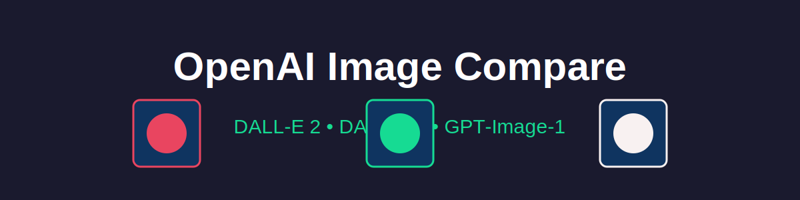

# Made as part of Live Coding Olympics

Full results with links:
https://docs.google.com/spreadsheets/d/1kgnVU6NZVTwqtUkrNetXTpm0oY7NsYGJn61u6-JMIoI/edit?usp=sharing

# OpenAI Image Model Comparison - Made with Windsurf and Sonnet 3.7 for Vibe Coding comparison

## 🎨 Overview

This web application allows you to compare images generated by different OpenAI image models side-by-side using the same prompt. See the evolution of AI image generation technology in real-time!

Models compared:

1. **DALL-E 2** (April 2022) - The second generation of OpenAI's image generation model
2. **DALL-E 3** (October 2023) - A significant improvement in image quality and prompt understanding
3. **GPT-Image-1** (2024) - OpenAI's newest image generation technology

## 🚀 Live Demo

Experience the application live: [https://username.github.io/openai-image-compare](https://username.github.io/openai-image-compare)

## ✨ Features

- Generate images with three different AI models simultaneously
- Compare the evolution of AI image generation technology
- Simple, intuitive user interface
- Secure API key handling (stored only in your browser's localStorage)
- Responsive design that works on desktop and mobile devices

## 🛠️ How to Use

1. Visit the [live demo](https://username.github.io/openai-image-compare) or open `index.html` in your web browser
2. Enter your OpenAI API key in the provided field
3. Type a prompt for image generation (be creative!)
4. Click "Generate Images" to create images with all three models in parallel
5. Compare the results to see how AI image generation has evolved

## 📋 Requirements

- An OpenAI API key with access to image generation models
- A modern web browser (Chrome, Firefox, Safari, Edge)
- Internet connection

## 🔒 Security Note

Your API key is stored locally in your browser's localStorage for convenience. It is never sent to any server other than OpenAI's official API endpoints. This application runs entirely in your browser - there is no backend server collecting your data.

## 💰 API Usage & Costs

This application uses the OpenAI API to generate images. Each image generation will count against your API usage limits and may incur charges based on your OpenAI account plan. Please be aware of the following:

- Each time you click "Generate Images," you are making three separate API calls
- Different models may have different pricing
- Check [OpenAI's pricing page](https://openai.com/pricing) for current rates

## 🔧 Technical Details

The application makes parallel API calls to OpenAI's image generation endpoints, using the following models:

- `dall-e-2` - Returns URL-based images
- `dall-e-3` - Returns URL-based images
- `gpt-image-1` - Returns base64-encoded image data

The application is built with vanilla JavaScript, HTML, and CSS - no frameworks or dependencies required.

## 🧠 How It Works

1. The application sends your prompt to OpenAI's API with three different model configurations
2. The API generates images based on your prompt for each model
3. The application displays the results side by side for comparison
4. For DALL-E 2 and DALL-E 3, the images are loaded from URLs provided by the API
5. For GPT-Image-1, the base64-encoded image data is converted to a displayable format

## 📚 Resources

- [OpenAI API Documentation](https://platform.openai.com/docs/api-reference/images)
- [OpenAI Image Generation Guide](https://platform.openai.com/docs/guides/images)
- [OpenAI Pricing](https://openai.com/pricing)

## 🤝 Contributing

Contributions are welcome! Feel free to open an issue or submit a pull request if you have any improvements or bug fixes.

## 📄 License

This project is licensed under the MIT License - see the [LICENSE](LICENSE) file for details.

## 🙏 Acknowledgements

- Built with OpenAI's image generation API
- Created to showcase the evolution of AI image generation technology
